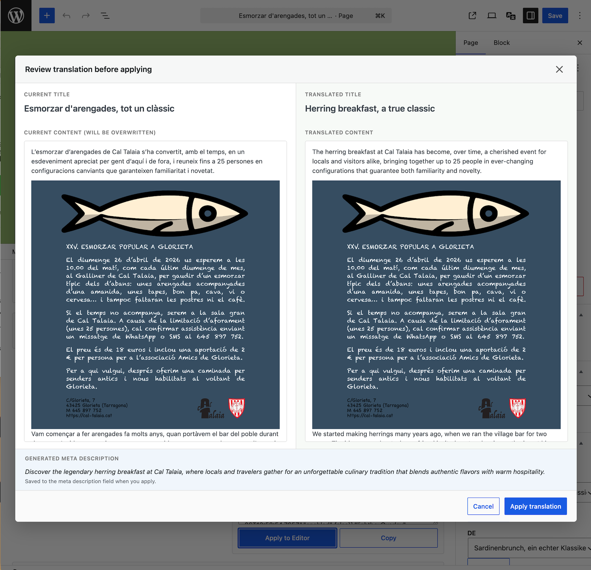
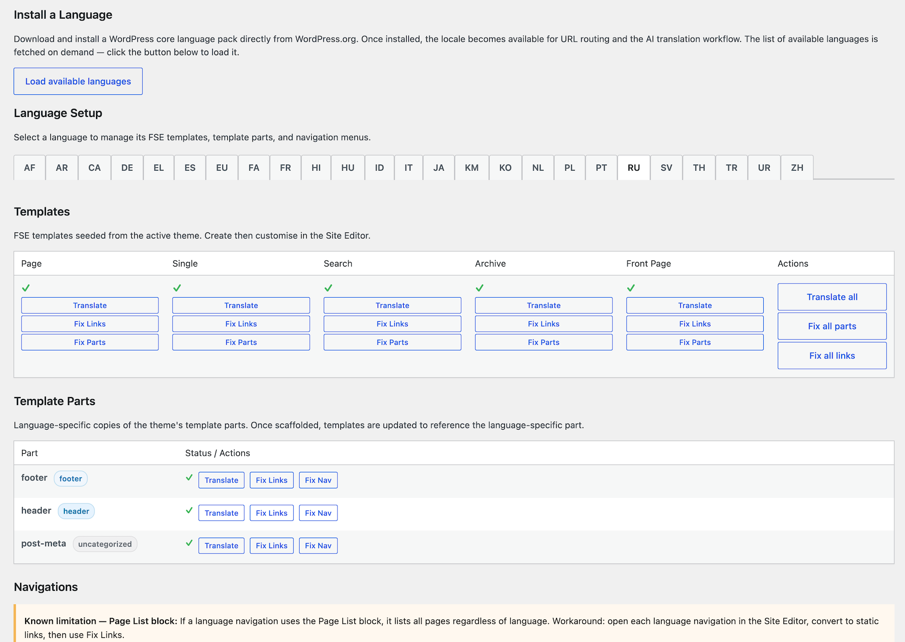
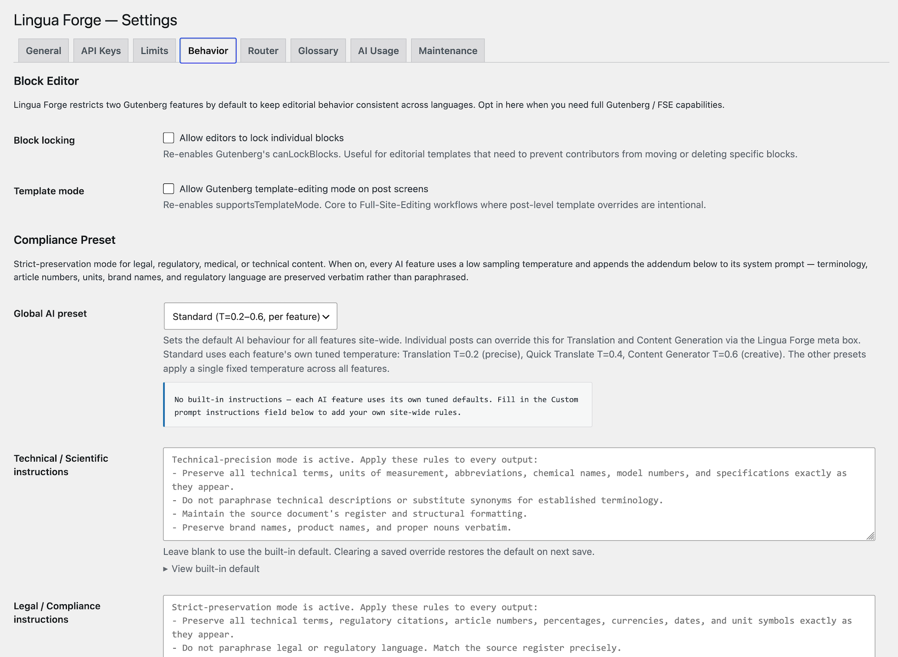
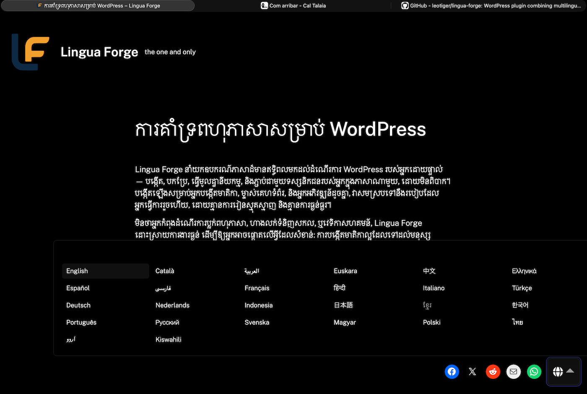
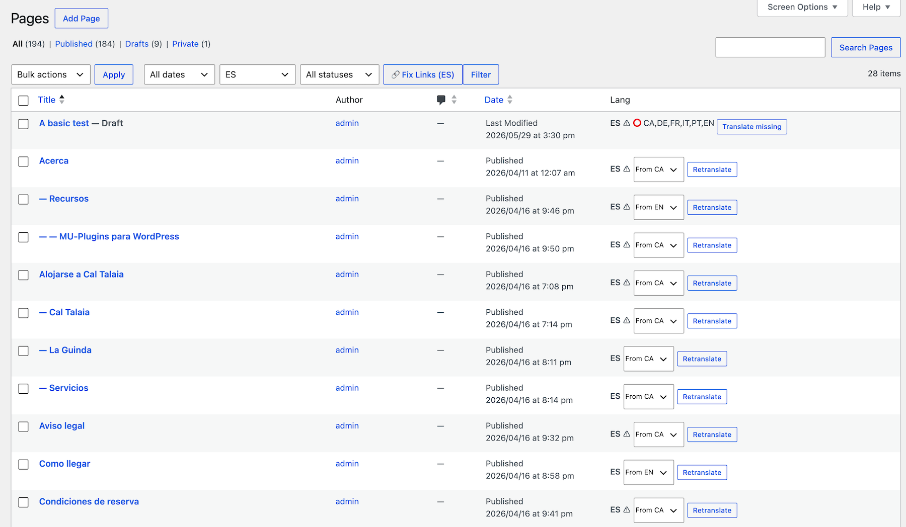
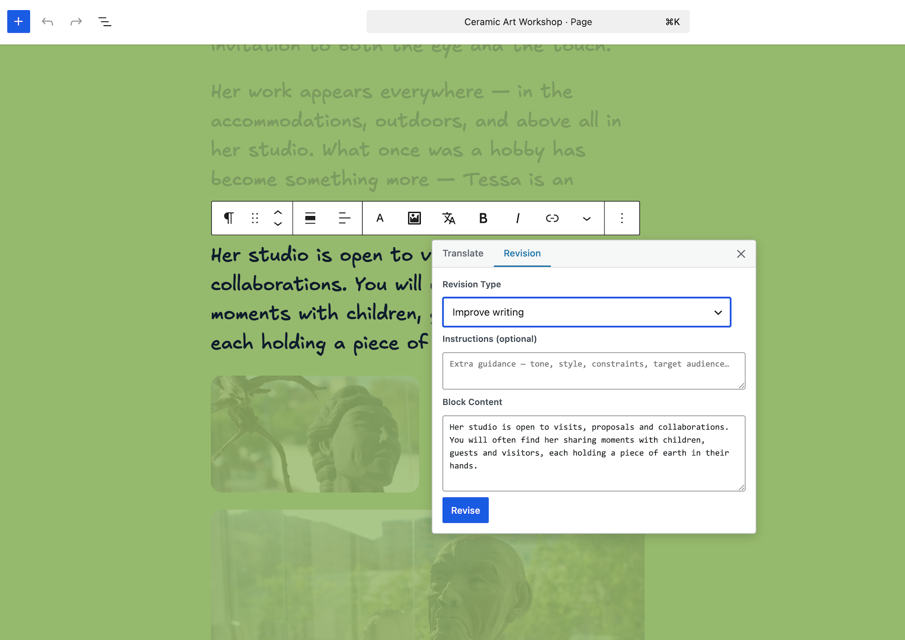
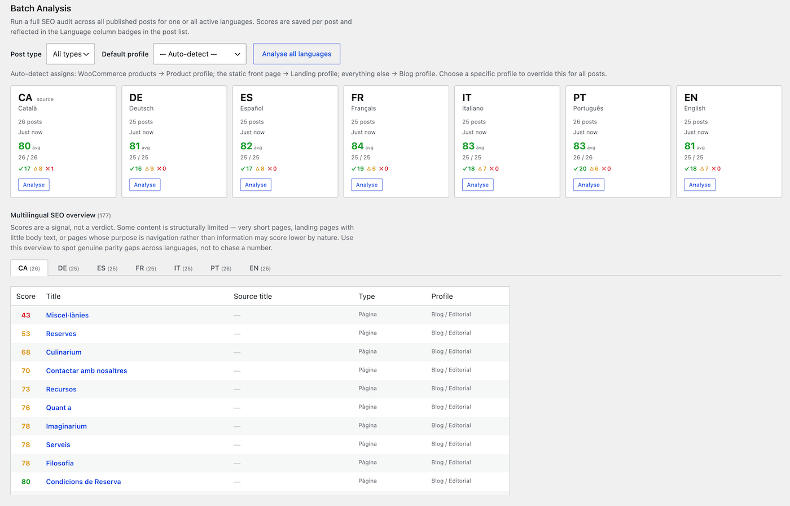

# Lingua Forge

> **Version 2.3.2 — stable, open for testing.**
> This release is considered stable and suitable for production use. Bug reports, compatibility reports, and pull requests are very welcome.

> **A note on WordPress.org.**
> Multilingual support is a fundamental need for any publishing platform. Gutenberg's name honours Johannes Gutenberg not merely for inventing a press, but for making the dissemination of knowledge possible at scale — a mission that stops at a language boundary if the platform does not natively cross it. We believe first-class multilingual support belongs in WordPress Core and in Gutenberg itself, not perpetually deferred to a third-party plugin ecosystem.
>
> Lingua Forge is not listed in the WordPress.org Plugin Directory — not because of code quality, security, trademark or licensing, but because WordPress.org maintains an undisclosed and ever-growing list of plugin names it considers reserved or off-limits, with no public registry, no appeal process, and no stated criteria. When gatekeeping operates without transparency, it does not protect a commons; it creates one. Closing a door on a legitimate, well-intentioned contribution is itself a door that opens toward something less accountable. Let's not name what less accountable stands for... What's clear, powers are at work at wordpress.org that don't want free multilingual support delivered for Wordpress. That in itself is bad for the coomunity and the platform itself. It's closing up, it's losing spirit! Feel free to star, not the plugin, we want to see it in core, but our reasoning. And if you want to do it for the plugin, welcome as well. (We have offered our domain, https://lingua-forge.com as a gift along with this plugin to the Wordpress community to do a better job for all of us.)
>
> Lingua Forge is distributed directly from this repository. It is permanently free, permanently open-source, and self-updates automatically after the first manual install. Collaboration welcome!

**GitHub:** https://github.com/leotiger/lingua-forge

**Lingua Forge:** https://lingua-forge.com

Lingua Forge is a WordPress plugin for sites that publish content in more than one language and want AI assistance built into the editorial workflow — without a paid third-party subscription service or a complex multi-plugin stack.

At its core it does three things that always end up intertwined on multilingual sites:

1. **Routes visitors to the right language version of every page** — via URL prefixes like `/de/` or `/fr/`, or via language subdomains like `de.example.com`, with a language switcher block, browser language detection, and an admin panel that keeps translations linked and warns you when source content has changed.

2. **Handles the full multilingual SEO surface natively — no companion plugin required** — hreflang, Open Graph with `og:locale`/`og:locale:alternate`, Schema.org JSON-LD with `inLanguage`, a dedicated XML sitemap with hreflang alternates, WooCommerce product schema, Social Icons block share: URL rewriting, and AI-powered SEO content analysis in both the Settings page and the block editor sidebar. A Compatibility tab shows live detection of any installed SEO plugin and explains exactly what Lingua Forge does for each feature area.

3. **Gives editors an AI assistant directly inside the block editor** — translate full pages, revise individual blocks, generate content from scratch, and fix quick-translate snippets on the fly, all without leaving WordPress. Results are previewed before anything is applied, and a terminology glossary ensures brand names and technical terms stay consistent across languages.

Everything ships as a single installable plugin. No external services beyond an AI provider API key (Anthropic, OpenAI, or Google Gemini — your choice). No subscription. No data leaves your server except the content you actively send for translation or generation.

---

## Table of Contents

- [How does it compare to WPML, Polylang, TranslatePress, Weglot, and MultilingualPress?](#how-does-it-compare-to-wpml-polylang-translatepress-weglot-and-multilingualpress)
- [Built on WordPress, not around it](#built-on-wordpress-not-around-it)
- [The story behind Lingua Forge](#the-story-behind-lingua-forge)
- [Features](#features)
- [Requirements](#requirements)
- [Translations](#translations)
- [Recommended companions](#recommended-companions)
- [Installation](#installation)
- [Configuration](#configuration)
- [Architecture](#architecture)
- [Language Router — detailed reference](#language-router--detailed-reference)
- [AI Content Tools — detailed reference](#ai-content-tools--detailed-reference)
- [Known Issues and Troubleshooting](#known-issues-and-troubleshooting)
- [Language Overrides](#language-overrides)
- [Third-party compatibility](#third-party-compatibility)
- [Performance](#performance)
- [Author](#author)
- [Changelog](#changelog)
- [Screenshots](#screenshots)
- [Field notes](#field-notes)
- [License](#license)

---

## How does it compare to WPML, Polylang, TranslatePress, Weglot, and MultilingualPress?

The short version: Lingua Forge covers the full multilingual workflow that the paid tiers of those plugins provide — language routing, complete multilingual SEO (hreflang, Open Graph, Schema.org, sitemap), FSE templates, translation groups, browser language redirect, translated slugs — while adding a deeper AI editorial layer and a complete SEO layer that no competitor ships natively and at zero licensing cost. The key difference is economic: there are no license fees, no annual renewals, and no per-word translation credits. If you use the AI features you pay your provider directly at API rates; if you translate manually, the cost is zero.

The competitive landscape splits into three architectural camps. **Post-based plugins** (WPML, Polylang, MultilingualPress, Lingua Forge) create a distinct post record per language — the same approach Lingua Forge uses. **String-replacement plugins** (TranslatePress) intercept page output at render time and swap strings in place; no separate posts, but adds render overhead and can be brittle in complex block-template contexts. **Cloud-proxy SaaS** (Weglot) stores translations externally and serves them via CDN — fast setup, but your content lives in their infrastructure and pricing scales with word count.

Where Lingua Forge differentiates: it is the only post-based plugin with a **complete native multilingual SEO layer** — hreflang, Open Graph with `og:locale`, Schema.org JSON-LD with `inLanguage`, a dedicated XML sitemap with hreflang alternates, WooCommerce product schema and OG, Social Icons block share-URL rewriting, and AI-powered SEO content analysis — all without a companion SEO plugin. It is also the only post-based plugin with native FSE / block-theme support from the ground up (language-specific templates, Language Switcher block), the only one with full support for any public Custom Post Type out of the box (Lang column, AI metabox, FSE template routing, and link fixer — all CPTs, zero configuration), the only one with a complete WooCommerce integration at zero cost (shared-stock delegation for price, stock, images, variations with translatable descriptions, categories, attribute term names translated in both block and classic themes, product brand, and WC product SEO schema), the only one with WP-CLI commands for scripted and automated workflows, and the only one with an iterative AI editorial toolset built into the post editor (content generation with multi-turn refinement, meta description generation, behavior presets, glossary, translation memory). AI costs go directly to the provider at published API rates — no credit intermediary.

Current gaps worth knowing: A general-purpose string translation UI (for third-party plugin strings outside the Language Overrides feature) is not yet included. For string translation today, [Loco Translate](https://wordpress.org/plugins/loco-translate/) is the recommended free companion — it provides in-admin `.po`/`.mo` editing, automatic sync with installed language packs, and developer extraction tools, and integrates cleanly alongside Lingua Forge with no conflicts. Slug translation is fully covered across all paths — full-page Translation dispatches the translated title via the Gutenberg Apply modal and WordPress derives the slug automatically; CLI commands set `post_name` from the translated title on every run.

→ [Full competitive analysis — Lingua Forge vs WPML vs Polylang vs TranslatePress vs Weglot vs MultilingualPress](COMPETITIVE-ANALYSIS.md)

## Built on WordPress, not around it

Lingua Forge is designed to stay as close to WordPress core and Full Site Editing conventions as possible. Translations are native WordPress posts. FSE templates, template parts, and navigation menus are native `wp_template`, `wp_template_part`, and `wp_navigation` posts — not string-swapped versions of a single shared entity. Blocks are blocks. Routing uses standard `WP_Query`. Nothing sits outside WordPress's own data model.

This is intentional and measurable: no runtime dependencies ship with the plugin (all dev tooling lives in `dev/`), Block API v3 is used throughout, the frontend carries no jQuery dependency, REST routes register at `rest_api_init`, and standard WordPress i18n and security conventions are applied without exception. The result is a plugin that behaves predictably alongside the rest of the WordPress ecosystem — no parallel data layer, no recomposition step, no render-time interception.

## The story behind Lingua Forge

If you want to understand where this plugin came from and why it exists as a free, open-source project rather than another subscription product, the blog post below covers the full picture in plain language — the necessity that started it, the weeks of intense work, the real website ([cal-talaia.cat](https://cal-talaia.cat)) that served as the test environment, the honest account of building an AI plugin with AI assistance (including the tokens spent and the many corrections along the way), and the social argument for why multilingual tools should belong to everyone.

→ [From a handful of messy files to a plugin anyone can use](blog-post-draft.md)

## Features

### Language Router

- **Two URL structure modes** — path prefix (`example.com/de/`) or subdomain (`de.example.com`), selectable from **Settings → Router → URL structure**. Subdomain mode requires wildcard DNS and TLS; path prefix mode works with standard WordPress permalink settings.
- Language detection from URL prefix (`/de/`), subdomain host (`de.example.com`), query param (`?lang=de`), and cookie
- Custom rewrite rules for language-prefixed URLs and category archives (path mode); no extra rules needed in subdomain mode
- Post and page translation groups linked via a shared TRID (UUID)
- Outdated translation tracking — warnings when source content is updated after a translation was synced
- **Full FSE template localisation** — language-specific templates (`page-de`, `single-fr`, `search-en`) are auto-assigned when a post's language is set. From **Settings → Router** you can scaffold a language copy of any template or template part in one click, AI-translate it, fix all internal links to point at the correct language equivalents, fix template-part slug references (`footer` → `footer-ca`), and fix `wp:navigation` ref IDs so each header and footer loads the correct language menu — all without CLI or manual database work.
- **Language-specific template parts** — scaffold, AI-translate, fix links, and fix navigation references for `header-{lang}`, `footer-{lang}`, and any other template part. Each is a native `wp_template_part` post with its own content, independent of the base language version.
- **Language navigation menus** — create per-language `wp_navigation` copies with AI-translated link labels and language-prefixed internal URLs. The Fix Nav action rewrites `wp:navigation` ref IDs inside template parts to point at the correct copy.
- **Site Editor page-list language filter** — when the Site Editor is opened on a navigation or template post, the sidebar page-list picker automatically scopes its `/wp/v2/pages` REST requests to the current navigation's language. The filter is resolved synchronously at PHP render time (no race condition on the initial load) and corrects itself asynchronously when the navigation ID is not in the initial URL.
- hreflang tags for singular, archive, and paginated views; automatically suppresses duplicate hreflang output from Yoast SEO, Rank Math, AIOSEO, and SEOPress via filter — see **Settings → SEO → Hreflang**
- Language switcher — available as a Gutenberg block (LSFLR Switcher), a `[lsflr_switcher]` shortcode, and a classic `Lsflr_Switcher_Widget` (Appearance → Widgets). All three produce identical output and support the same `direction`, `show`, and `customLabel` options. The `linguaforge_switcher_output` filter wraps all three entry points so themes and third-party plugins can customise the HTML without touching templates
- Admin link fixer — scans translated pages for internal links pointing to the wrong language version and repairs them via AJAX
- Plugin translation override — custom `.mo` files placed in `wp-content/uploads/lingua-forge/i18n-overrides/` are loaded automatically, overriding third-party plugin strings for each locale (e.g. swapping "room" → "apartment" in VikBooking). Files survive plugin updates. Manage them from **Settings → Lingua Forge → Language Overrides** or drop them in directly via FTP/SFTP.
- **Full Custom Post Type support** — every public CPT (WooCommerce `product`, any third-party CPT) automatically receives the full admin layer: Lang column with outdated/missing indicators and Retranslate/Translate-missing buttons, language and status filter dropdowns, quick-edit language control, AI translation metabox, FSE template selector, Translation Memory eligibility, and link-fixer scan. No configuration required. Three opt-out filters available: `linguaforge_column_post_types`, `linguaforge_ai_metabox_post_types`, `linguaforge_link_fixer_post_types`
- **WooCommerce integration** — translated products carry only content fields (title, description, meta description); price, SKU, stock, dimensions, images, and taxonomy assignments are served transparently from the source-language product at runtime. Variable products are fully supported: translated product variations are created automatically with their descriptions (`_variation_description`) translatable via the standard Retranslate button, while operational meta (price, stock) delegates from source variations. Attribute term names display in the visitor's language (e.g. "Rot"/"Blau" on DE pages) via `_lf_term_name_{lang}` termmeta in both classic templates and WC block themes. Product brand (`product_brand`, native WC 10.x) is delegated automatically; third-party brand taxonomies are registerable via the `linguaforge_wc_delegate_taxonomies` filter. REST API writes to translated products return HTTP 422 with the source product ID for safe resolution. Requires WooCommerce 9.0+ and WordPress 6.9+
- DB index on `wp_postmeta (meta_key, meta_value)` created on activation for fast `_lang` queries

### SEO

Lingua Forge provides a complete multilingual SEO layer. No additional SEO plugin is required. Configure everything from **Settings → SEO**.

**Hreflang** — `<link rel="alternate" hreflang>` for every configured language on every page, including `x-default`. Automatically suppresses duplicate hreflang output from Yoast SEO, Rank Math, AIOSEO, and SEOPress via WordPress filter hooks.

**Open Graph + Twitter Cards** — outputs `og:locale` (current language) and `og:locale:alternate` (every other configured language) on every page — the multilingual OG signals that SEO plugins cannot produce without knowledge of your routing configuration. In auto mode it also outputs the full OG base set (`og:type`, `og:title`, `og:description`, `og:url`, `og:image`, Twitter Cards) when no SEO plugin is detected, deferring to the SEO plugin when one is present to avoid duplicate tags. Default OG image with full fallback chain: featured image → site logo → site icon → admin-configured default.

**Schema.org JSON-LD** — outputs `Article`/`WebPage` on singular posts and pages, `WebSite` on the front page/blog index, and `Product` on WooCommerce product pages (when WC is active). Every type includes the `inLanguage` BCP 47 annotation. Defers entirely when Yoast/Rank Math is detected — conflicting JSON-LD graphs cause validation errors and there is no clean way to supplement an existing graph.

**XML Sitemap** — dedicated multilingual sitemap at `/lf-sitemap.xml` with `xmlns:xhtml` namespace and `<xhtml:link rel="alternate" hreflang>` entries for every translation group. Announced automatically in `robots.txt`. One-click Bing and Yandex ping buttons. robots.txt detection panel with option to add the `Sitemap:` directive to an existing physical file.

**Social Share** — extends the WordPress Core Social Icons block. Set any icon's link URL to `share:facebook`, `share:x`, `share:linkedin`, `share:whatsapp`, `share:telegram`, `share:email`, `share:reddit`, `share:pinterest`, `share:mastodon`, `share:copy`, `share:native`, or `share:auto`; Lingua Forge rewrites it at render time. The JS actions (`share:copy`, `share:native`, `share:auto`) use the Clipboard API and Web Share API with clipboard fallback, and show a toast notification on success.

**SEO Content Analysis** — rule-based 0–100 score covering title length, meta description quality (uses AI-generated meta description when available), word count, heading structure, image alt coverage, and internal link profile. Three entry points: (1) **Single-post** — click Analyze on any item in **Settings → SEO → Analysis** to get an instant score for that post. (2) **Block editor sidebar** — the Document panel shows the current post's score and a "Run AI Analysis" button that opens a modal with natural-language recommendations, title suggestions, and meta description improvements. (3) **Batch / Multilingual parity** — a card grid in **Settings → SEO → Analysis** (one card per active language) lets you analyze an entire language in one pass and view the results as a **Multilingual SEO overview**: per-language tabs showing every post with its score, a direct edit link, the source-language title for cross-language parity comparison, post type, and profile. WooCommerce system pages are automatically excluded from batch scoring. A hint below the heading explains that low scores often reflect structural limits rather than improvable content.

**WooCommerce product SEO** *(requires WooCommerce)* — adds `og:type=product`, `og:price:amount`, `og:price:currency`, `og:availability`, and their `product:` namespace equivalents on product pages. Product schema includes translated name, description, `inLanguage`, and a correctly resolved `offers` object (price and availability from the source-language product via MetaDelegate).

**Compatibility** — the Compatibility tab shows live detection of any active SEO plugin (Yoast, Rank Math, AIOSEO, SEOPress) with a per-feature explanation of what Lingua Forge is doing and why — no manual configuration needed.

**Meta description field** — custom field editable in the Classic meta box and Block Editor on every public post type. Character counter with green/amber/red guidance (140–160 optimal range). Fallback chain: AI-generated field → post excerpt → trimmed content. AI generation available in one click from the AI metabox (`_linguaforge_meta_description` postmeta key, readable by third-party integrations).

### AI Content Tools

Supports **Anthropic Claude**, **OpenAI**, and **Google Gemini** as interchangeable backends. All results appear in a review panel — nothing is applied automatically.

- **Meta Description Generator** — language-aware, 140–160 character output with SEO quality indicator
- **Excerpt Generator** — concise editorial excerpt up to 240 characters, language-aware
- **Content Translation** — full post and page translation preserving all Gutenberg block markup, block attribute strings (accordion summaries, image alt text, etc.), and footnotes. Chunk mode for translating individual snippets
- **Content Generator** — drafts or rewrites post content from hints, tone, and output-type controls. Outputs native Gutenberg block markup
- **Quick Translate** — admin toolbar popover with three modes: **Translate** any text snippet into a chosen language, **Create** new content from hints and tone, and **Refine** any result iteratively with additional instructions. Also available inside the Gutenberg / FSE editor toolbar
- **AI Behavior Presets** — four named presets (Standard, Technical / Scientific, Legal / Compliance, Creative / Marketing), each with a tuned temperature and system-prompt addendum. Configurable globally from **Settings → Behavior** and overridable per post from the Lingua Forge metabox (Translation and Content Generator only)
- **Translation Memory** — opt-in block-level translation cache shared across posts; only untranslated blocks are sent to the API, reducing token usage for recurring content. Enable from **Settings → AI Usage & Cache → Translation Memory**
- **Glossary** — user-managed terminology table per language pair. Terms are injected into every translation prompt. Manage from **Settings → Glossary**
- **Side-by-side diff preview** — "Apply to Editor" opens a two-column modal showing current vs translated content before anything is written
- **Footnote tab** in the Block Action popover — translate or revise individual footnotes without switching to chunk mode; only visible when the popover is opened from inside the WordPress footnote editing UI (not from the main block toolbar)
- **AI Usage tracking** — every API call is logged by feature, provider, model, and date. A usage summary (requests, input tokens, output tokens) is available in **Settings → AI Usage** for any date range
- SHA-256 hash-based result caching in a dedicated custom table; per-language translation cache; force-refresh control
- Configurable model endpoints per provider and tier from the Settings page — no code changes needed when a new model version ships
- **WP-CLI support** — five commands for scripted and automated workflows: `translate`, `retranslate`, `fill_translations`, `missing_translations`, and `cache_clear`. All translation commands accept `--with-meta-description` to generate and save an AI meta description for each target post in the same pass

---

## Requirements

- WordPress 6.4 or later (block theme / FSE recommended)
- PHP 8.1 or later
- Permalink structure set to anything other than Plain
- An API key for at least one supported AI provider (Anthropic, OpenAI, or Gemini)

**Optional — WooCommerce integration:** WooCommerce 9.0 or later is required (which in turn requires WordPress 6.9 or later). The core plugin — language routing, full SEO layer, AI tools — works on WordPress 6.4 without WooCommerce. If WooCommerce is not active the WooCommerce delegation layer and WooCommerce-specific SEO output are silently skipped.

**Multisite:** Lingua Forge is not tested on WordPress Multisite. Per-site activation — each site in the network manages its own languages, settings, and AI credentials independently — is expected to work. Network-wide activation is not supported and may produce unexpected behaviour.

---

## Translations

Lingua Forge's own interface is translated into 26 languages, so you can work in your native language right out of the box:

| Code | Language | Code | Language |
|------|----------|------|----------|
| `ar` | Arabic | `ko_KR` | Korean |
| `ca` | Catalan | `nl_NL` | Dutch |
| `de_DE` | German | `pl_PL` | Polish |
| `el` | Greek | `pt_PT` | Portuguese |
| `en_US` | English (US) | `ru_RU` | Russian |
| `es_ES` | Spanish | `sv_SE` | Swedish |
| `eu` | Basque | `sw` | Swahili |
| `fa_IR` | Persian | `th` | Thai |
| `fr_FR` | French | `tr_TR` | Turkish |
| `hi_IN` | Hindi | `ur` | Urdu |
| `hu_HU` | Hungarian | `zh_CN` | Chinese (Simplified) |
| `id_ID` | Indonesian | `it_IT` | Italian |
| `ja` | Japanese | `km` | Khmer |

All translation files (`languages/lingua-forge-{locale}.po/.mo/.l10n.php`) are bundled in the plugin. To contribute a new translation or improve an existing one, open a pull request against the `languages/` directory.

---

## Recommended companions

**[Loco Translate](https://wordpress.org/plugins/loco-translate/)** — for translating third-party plugin and theme strings (`.po`/`.mo` editing, automatic language-pack sync, developer extraction). Integrates cleanly alongside Lingua Forge with no conflicts.

---

## Installation

**The first install is manual** (Lingua Forge is self-distributed — see the note at the top of this file):

1. Download the latest `lingua-forge-{version}.zip` from the [Releases page](https://github.com/leotiger/lingua-forge/releases)
2. In your WordPress admin go to **Plugins → Add New → Upload Plugin**, choose the ZIP, and click **Install Now**
3. Activate **Lingua Forge** from **Plugins → Installed Plugins**
4. Go to **Lingua Forge** in the admin sidebar, select a provider, and enter your API key

**After the first install, updates are automatic.** WordPress checks for new releases every 12 hours and displays the standard update badge in **Plugins → Installed Plugins** when one is available — one-click update from there, no manual download required.

```
wp-content/
  plugins/
    lingua-forge/
      lingua-forge.php       ← main plugin file
      language-router/       ← Language Router + full SEO layer (hreflang, OG, schema, sitemap, social share)
        includes/seo/        ←   SeoManager · SchemaManager · SocialShare · SitemapManager
      meta-description/      ← Meta description meta box module (legacy; SEO suite is in language-router/includes/seo/)
      ai/                    ← AI content tools + Settings page with SEO tab + WooCommerce SEO
```

> If you are migrating from the mu-plugin versions of these tools, deactivate or remove `wp-content/mu-plugins/language-router/`, `wp-content/mu-plugins/meta-description/`, and `wp-content/mu-plugins/wpenhance-ai/` (or `wpai/`) before activating Lingua Forge to avoid duplicate hooks.

---

## Configuration

### Language Router

The source language and active language list are configured from **Settings → Lingua Forge → Router** — no code changes required. The filters below are developer overrides that take precedence over the stored settings:

```php
// Override the source language programmatically (takes priority over the Router setting)
add_filter( 'lf_primary_language', fn() => 'ca' );

// Override the active language list programmatically
add_filter( 'lf_languages_list', fn() => ['ca', 'es', 'en', 'de', 'fr'] );
```

#### Filters reference

| Filter | Default | Description |
|---|---|---|
| `lf_primary_language` | Value from Router settings | Developer override for the source / default language code. Takes priority over **Settings → Router** |
| `lf_languages_list` | Value from Router settings | Developer override for the full active language list. Takes priority over **Settings → Router** |
| `lf_lang_force_locale` | `['ca' => 'ca']` | Hard locale overrides (e.g. for VikBooking) |
| `lf_lang_fallback_map` | `['en'=>'en_US', …]` | Locale fallbacks when no installed locale matches |
| `lf_lang_default_fallback` | `'en_US'` | Last-resort locale |
| `lf_base_domain` | Auto from `home_url()` | Override the bare domain used for subdomain URL construction (useful when `home_url()` includes `www` or a non-apex hostname) |
| `lf_hreflang_mode` | `'custom'` | `'custom'` outputs Lingua Forge hreflang tags and suppresses SEO-plugin duplicates. Any other value (e.g. `'off'`) disables built-in output and hands control to the SEO plugin |
| `lf_hreflang_x_default` | Source-language URL | Override the URL used for the `x-default` hreflang tag. Receives `$url`, `$post_id`, `$translations` |
| `lf_i18n_overrides_dir` | `uploads/lingua-forge/i18n-overrides/` | Override the storage path for third-party `.mo` override files |
| `linguaforge_translation_languages` | Built-in list | Override the AI translation target language list — see Content Translation section |

#### WordPress language setup

Languages are configured entirely inside **Settings → Lingua Forge → Router**. There is no need to install WordPress language packs or visit **Settings → General → Site Language** to add a language to your site — Lingua Forge manages its own language registry independently. Adding or removing a language automatically flushes the rewrite rules so the new URL prefix is live immediately, with no manual Permalinks save required.

#### WP site language vs. primary content language

**WordPress site language** (`Settings → General → Site Language`) controls the admin interface and the locale WordPress uses internally.

**Primary content language** (set in **Settings → Lingua Forge → Router**) is the language your actual content is written in — the language that maps to the root URL path (no prefix) and acts as the source for all translations. Developers can override it via the `lf_primary_language` filter.

> **Requirement: the WP site language must be one of the languages used for content.**

Lingua Forge builds its valid-language list from installed WordPress language packs, plugin `.mo` files in the i18n-overrides folder, and the explicitly configured primary language. WordPress's own site locale is intentionally excluded from this list when the primary content language is explicitly set — to prevent the admin UI language from being treated as a content language.

However, WordPress core and WooCommerce use `get_locale()` directly in a number of operations (object-cache keys, REST API locale, early text domain loads, locale-sensitive number and date formatting). Even with Lingua Forge switching the locale via `switch_to_locale()`, some of those operations happen before or outside the switch. When the WP site language is completely outside the content language set, mismatches accumulate:

- **WooCommerce product queries break** — language detection falls back to the WP site locale, injecting the wrong `_lf_lang` constraint and returning zero products.
- **Product image delegation fails** — source product ID resolution relies on correctly identified language codes throughout the TRID chain.
- **The language switcher may render a spurious non-content language** option (fixed in 2.2.16 for the routing layer, but the locale-level conflicts in WooCommerce remain).
- **REST API responses** always use the WP site locale (REST is excluded from locale switching); this affects Gutenberg block data fetched via REST.

**Supported configurations:**

| WP site language | Content languages | Result |
|---|---|---|
| `ca` | `ca` (primary), `es` | Fully supported — site locale matches primary content |
| `es_ES` | `ca` (primary), `es` | Fully supported — site locale is one of the content languages |
| `en_US` | `ca` (primary), `es`, `en` | Fully supported — English is an active content language |
| `en_US` | `ca` (primary), `es` | ⚠ **Not supported** — English is not a content language; WooCommerce and product image delegation will not work reliably |

**Recommendation:** Set `Settings → General → Site Language` to the primary content language, or to one of the active secondary languages. For WooCommerce sites the restriction is strict — mismatched locales cause product queries and image delegation to fail in ways that cannot be reliably patched at the plugin layer.

---

### AI Content Tools

#### Choosing a provider

Navigate to **Settings → Lingua Forge** and select the active provider from the dropdown, or define the constant in `wp-config.php`:

```php
define('LINGUAFORGE_PROVIDER', 'anthropic'); // 'anthropic' | 'openai' | 'gemini'
```

#### API keys

Enter keys directly from **Settings → Lingua Forge**. Keys are stored encrypted in `wp_options` using AES-256-GCM (with the provider slug as authenticated data) derived from WordPress's own auth salts — plaintext keys never touch the database.

For sites where development, staging, and production share a `wp-config.php` copy (and therefore the same `wp_salt('auth')` value), define a unique `LINGUAFORGE_SECRET` constant in each environment to ensure each has an independent encryption key:

```php
define( 'LINGUAFORGE_SECRET', 'your-64-char-random-string-here' );
```

Generate a value with `openssl rand -base64 48`. Note: changing this constant invalidates stored ciphertexts, so re-enter your API keys afterward.

**Fallback resolution order** (highest to lowest priority):
1. Encrypted value in `wp_options` (set via the Settings page)
2. Server environment variable (`ANTHROPIC_API_KEY`, `OPENAI_API_KEY`, `GEMINI_API_KEY`)
3. PHP constant of the same name defined in `wp-config.php`

#### Models

Navigate to **Settings → Lingua Forge → Models** to override the model string for any provider and tier:

| Tier | Anthropic | OpenAI | Gemini | Used by |
|---|---|---|---|---|
| **Light** | `claude-haiku-4-5-20251001` | `gpt-4o-mini` | `gemini-2.5-flash-lite` | Meta Description, Excerpt Generator |
| **Quality** | `claude-sonnet-4-6` | `gpt-4o` | `gemini-2.5-flash` | Translation, Content Generator |

These are the built-in defaults for each provider. Leave a field blank to use the built-in default for your active provider. To update to a new model version when one ships, enter the new identifier in Settings — no code change or deployment needed.

Token budgets and input limits for Translation are configured separately under **Translation Limits** — see the Content Translation section below.

#### Provider timeouts

All provider API calls use a 300-second HTTP timeout by default. This can be overridden via the `linguaforge_ai_retry_policy` filter — add a `'timeout'` key to the returned array (minimum 30 s). If your host caps `max_execution_time` below the timeout value (common on managed hosts at 30–60 s), long translations may fail at the PHP level before the HTTP request completes.

---

## Architecture

```
lingua-forge/
  lingua-forge.php                   ← Plugin entry point, constants, activation hooks
  includes/
    class-updater.php                ← Self-hosted update checker (Linguaforge_Updater)
  language-router/
    language-router.php              ← Module entry: boots classes, defines LF_LANG, lf_* wrapper functions
    includes/
      class-language-router.php      ← LinguaForge\Router\Router (aliased Language_Router)
      class-lsflr-switcher.php       ← LinguaForge\Router\Switcher (aliased LSFLR_Switcher)
      class-lsflr-switcher-widget.php← Lsflr_Switcher_Widget (global namespace — classic WP widget)
      class-lsflr-link-fixer.php     ← LinguaForge\Router\LinkFixer (aliased LSFLR_Link_Fixer)
      seo/
        class-hreflang.php          ← Hreflang output, canonical removal, SEO plugin suppression
        class-seo-manager.php       ← Open Graph / og:locale / Twitter Cards (wp_head priority 2)
        class-schema-manager.php    ← Schema.org JSON-LD Article/WebPage/WebSite/Product (priority 3)
        class-social-share.php      ← Social Icons block share: URL rewriting + footer JS
        class-sitemap-manager.php   ← /lf-sitemap.xml + robots.txt + ping
      rest/
        class-data-endpoints.php    ← LinguaForge\Router\REST\DataEndpoints
                                       GET /wp-json/lingua-forge/v1/languages
                                       GET /wp-json/lingua-forge/v1/post/{id}/translations
    assets/
      lsflr.css                      ← Switcher styles
      social-share.js                ← copy/native/auto share JS actions
    languages/                       ← Lingua Forge own translation files (.pot / .po / .mo)
  meta-description/
    meta-description.php             ← LinguaForge\MetaDescription\Module — meta description meta box + <meta name="description"> output (the full SEO layer lives in language-router/includes/seo/)
  ai/
    ai.php                           ← Module entry: constants, autoloader, plugin boot
    includes/
      Core/
        Autoloader.php               ← PSR-4 class autoloader (namespace: LinguaForge\AI)
        Plugin.php                   ← Bootstrap: registers hooks, initialises features
        Config.php                   ← Provider + model + preset resolution
        KeyStore.php                 ← AES-256-GCM encrypted API key storage
        CacheStore.php               ← SHA-256 hash-based result cache (custom table)
        TranslationMemory.php        ← Block-level TM cache shared across posts
        Glossary.php                 ← Per-language-pair terminology table
        UsageRecorder.php            ← Per-call token usage telemetry
        BlockTextExtractor.php       ← Extracts / reinserts translatable block attribute strings
        JsonRepair.php               ← JSON normaliser / balanced-brace extractor for AI responses
        TranslationDebug.php         ← Debug helpers for translation pipeline
      Contracts/
        AIProviderInterface.php      ← Contract all providers must satisfy
      Features/
        Contracts/
          FeatureInterface.php       ← Contract all features must satisfy
        Registry.php                 ← Registers active features with the REST controller
        MetaDescription.php
        ExcerptGenerator.php
        Translation.php
        TranslationTrigger.php       ← linguaforge_trigger_translation() backend
        ContentGenerator.php
      Providers/
        AbstractProvider.php         ← Shared HTTP + retry logic for all providers
        ProviderFactory.php
        WorkerConfig.php             ← Immutable DTO: model, max_tokens, temperature
        Anthropic.php
        OpenAI.php
        Gemini.php
      Admin/
        MetaBox.php                  ← Post editor metabox: AI panel (with per-page preset select)
        AdminToolbar.php             ← Admin bar Quick Translate node
        PostListColumn.php           ← "Translate missing" button in the Posts/Pages list
        SettingsPage.php             ← Settings → Lingua Forge (10-tab layout, delegates to Tabs/)
        Settings/Tabs/
          Tab.php                    ← Abstract base class for all tab classes
          GeneralTab.php             ← Provider + model selection
          ApiKeysTab.php             ← API key entry + Test Connection
          LimitsTab.php              ← Quotas, rate limits, capability gate
          BehaviorTab.php            ← AI behavior presets and toggles
          RouterTab.php              ← Language Router settings; delegates FSE panels to Sections/
          GlossaryTab.php            ← Per-language-pair terminology table
          SeoTab.php                 ← SEO (inner tabs: Hreflang, Open Graph, Social Share, WooCommerce, Schema.org, Sitemap, Analysis, Compatibility)
          AiUsageTab.php             ← Read-only token usage log
          MaintenanceTab.php         ← Cache, debug, language overrides, TM tools
          SystemTab.php              ← Diagnostic environment panel (read-only)
        Settings/Tabs/Sections/
          TemplatesSection.php       ← FSE template scaffold/translate/fix UI
          TemplatePartsSection.php   ← Template part scaffold/translate/fix UI
          NavigationsSection.php     ← Language navigation create/translate UI
          PatternsSection.php        ← CPT-scoped block pattern translation UI
        Settings/Panels/
          HreflangPanel.php          ← Hreflang enable/disable + SEO plugin suppression status
          OpenGraphPanel.php         ← OG mode selector + default image + detection notices
          SocialSharePanel.php       ← share: URL rewriting toggle + usage guide
          WooCommerceSeoPanel.php    ← WC product OG/schema toggle + tag reference
          SchemaPanel.php            ← Schema.org per-type toggles + plugin deference status
          SitemapPanel.php           ← Sitemap URL + cache + ping buttons + robots.txt panel
          SeoAnalysisPanel.php       ← Rule-based content audit + AI analysis + batch/parity; AJAX handlers
          CompatibilityPanel.php     ← Live SEO plugin detection + per-feature behaviour table
          SystemPanel.php            ← Environment info, permalink check, repair tools, debug copy
      FseLocalisation/
        TemplateDefinitions.php      ← CPT-slot template list (dynamic per active CPTs)
        PartDiscovery.php            ← Template-part registry queries
        PatternExpander.php          ← Inline expansion of nested wp:pattern refs
        PatternDiscovery.php         ← CPT-scoped pattern registry + translation store
        PatternHandler.php           ← AJAX handler for block pattern AI-translation
        ScaffoldHandler.php          ← AJAX handler for FSE template/part scaffold
        TranslateHandler.php         ← AJAX handler for FSE template/part AI-translation
        LinkFixer.php                ← AJAX handler for internal link rewriting
        PartRefFixer.php             ← AJAX handler for template-part slug rewriting
      Integrations/
        WooCommerce/
          Bootstrap.php              ← Entry point: wires all WC hooks on plugins_loaded priority 20
          MetaDelegate.php           ← get_post_metadata filter (individual + bulk): operational meta read from source
          StockRouter.php            ← update/add_post_metadata filter: stock writes routed to source
          VariationDelegate.php      ← pre_get_posts: translated variation children served directly, fallback to source
          VariationSync.php          ← wp_after_insert_post: creates translated variations; syncs WC structural taxonomies
          TaxonomyDelegate.php       ← wp_get_object_terms: category/tag/pa_*/brand delegated; object_id rewrite for cache
          CatalogQuery.php           ← woocommerce_product_query: language filter for WC catalog queries
          TermNameFilter.php         ← term_name / get_term / wp_get_object_terms: translated attribute names (all paths)
          TermNameAdmin.php          ← Term edit/add screen fields for _lf_term_name_{lang} termmeta
          RestWriteGuard.php         ← woocommerce_rest_pre_insert_*: HTTP 422 on PUT/PATCH to translated products
      CLI/
        Commands.php                 ← wp linguaforge translate / retranslate / fill_translations / missing_translations / cache_clear
      REST/
        FeatureController.php        ← POST /lingua-forge/v1/feature/{key}/{post_id}
                                        POST /lingua-forge/v1/translate-chunk
                                        POST /lingua-forge/v1/create-chunk
                                        POST /lingua-forge/v1/revise-block
        RateLimiter.php              ← Per-user request rate limiting for REST endpoints
    assets/
      admin.js / admin.css           ← Meta box UI
      toolbar-translate.js / .css    ← Admin bar Quick Translate popover
      editor-translate.js / .css     ← Editor toolbar Quick Translate
      block-action.js / .css         ← Block-level action buttons
      post-list.js                   ← "Translate missing" button AJAX handler
      settings.css                   ← Settings page styles
      settings-tabs.js               ← Settings page tab switching
      router-tab.js                  ← Router tab AJAX actions (lang install, panel wiring)
      fse-scaffold.js                ← Scaffold template/part AJAX
      fse-translate.js               ← AI-translate template/part AJAX
      fse-link-fixer.js              ← Fix Links AJAX
      fse-part-fixer.js              ← Fix Parts AJAX
      fse-patterns.js                ← CPT-scoped block pattern translation AJAX
      preset-preview.js              ← Behavior preset live preview
      test-connection.js             ← API Keys tab "Test Connection" AJAX
    templates/prompts/               ← AI prompt templates (plain text, editable)
```

### Constants

Defined in `lingua-forge.php` and available to all sub-modules:

| Constant | Value |
|---|---|
| `LINGUAFORGE_FILE` | Absolute path to `lingua-forge.php` |
| `LINGUAFORGE_PATH` | `plugin_dir_path()` of the plugin root (trailing slash) |
| `LINGUAFORGE_URL` | `plugin_dir_url()` of the plugin root (trailing slash) |
| `LINGUAFORGE_VERSION` | Plugin version string |

### WordPress-core and FSE conformance

Lingua Forge is designed to stay as close to WordPress core and Full Site Editing conventions as possible:

- **No runtime dependencies** — only what WordPress provides ships in the plugin. All dev tooling (Composer, npm, PHPUnit, PHPCS, PHPStan, ESLint) lives in `dev/` and is excluded from the distribution via `.distignore`.
- **Block API v3** — the `missing-translation-notice` block uses `apiVersion: 3`, server-side rendering via `render: "file:..."`, a proper `editorScript` with dependency manifest, and full block-supports (colour, spacing, typography). No build step required.
- **No jQuery on the frontend** — the language-sync script patches `XMLHttpRequest.prototype.open` and `window.fetch` natively; no jQuery dependency is declared or loaded.
- **REST registration at `rest_api_init`**, not `init`. Permission callbacks return `bool` or `WP_Error`. Custom routes are namespaced under `lingua-forge/v1`.
- **FSE post types used correctly** — templates, template parts, and navigations are managed via `wp_template`, `wp_template_part`, and `wp_navigation` with correct taxonomy bindings.
- **i18n** — textdomain `lingua-forge` throughout; `wp_set_script_translations()` wired for all editor assets; no manual `load_plugin_textdomain` call (WP 4.6+ handles this automatically for slug-matched plugins).
- **Security conventions** — capability + nonce checks on every entry point; `wp_unslash` before sanitise, `esc_*` on every output; `wp_handle_upload()` with full MIME-magic validation.

### Roles and capabilities

Lingua Forge applies two separate capability tiers depending on the operation:

**Editor-level operations** — AI chunk translation, block revision, excerpt and meta description generation — gate on the `linguaforge_required_capability` filter, which defaults to `edit_posts`. Administrators can raise this in Settings → Limits to `edit_published_posts`, `edit_others_posts`, or `manage_options` if the site should restrict AI spending to more senior roles.

**Admin-only operations** — FSE template and template-part scaffold, AI-translate, fix-links, fix-parts, fix-nav, and language navigation creation — always gate on `manage_options`. The `linguaforge_required_capability` filter does not apply to these paths. This is intentional: FSE operations modify shared theme assets that affect every visitor, so only site administrators should authorise them regardless of the AI capability setting.

The practical result: a site that raises `linguaforge_required_capability` to `manage_options` makes all AI operations admin-only. A site that leaves it at `edit_posts` runs a two-tier model where editors can translate post content but only administrators can touch templates and navigations.

### Boot order

Language Router boots first because its constructor defines the `LF_LANG` constant at file-load time — before any `init` hooks fire. Meta Description boots second (no dependencies). The AI module boots third and may depend on `LF_LANG` for language-aware features.

---

## Language Router — detailed reference

### How language detection works

Detection runs in priority order:

0. **Subdomain host** — `de.example.com` is checked first when subdomain routing mode is active; the language is extracted from the HTTP host before any path or parameter is inspected
1. **URL segment** — `/de/` at the start of the path (path mode only; no prefix exists in subdomain mode)
2. **`?lang=` query param** — used for search requests in path mode (`/?lang=de&s=query`)
3. **Cookie** — `lf_lang` persists the last detected language across requests. In subdomain mode the cookie is scoped to the apex domain (`.example.com`) so it is shared across all language subdomains
4. **Browser `Accept-Language` header** — opt-in; enabled from **Settings → Router → Browser language redirect**. Parses the header in quality order, matches both exact two-char codes (`de`) and regional tags (`de-DE`, `de-AT`) against the active language list. Only fires when steps 0–3 yield no result — i.e. a genuine first visit with no prior preference recorded. Once the visitor picks a language via the switcher, `set_lang_cookie()` fires and the cookie wins on all future visits
5. **Fallback** — the configured source language

`detect_lang()` uses host/URL + cookie (+ browser header when the opt-in is enabled). `detect_lang_safe()` additionally checks `$_GET['lang']` (safe to call before WP is fully loaded). The result is stored in the `LF_LANG` constant.

### Translation model

Every translatable post carries four post-meta fields, all registered with `show_in_rest: true`:

| Meta key | Type | Description |
|---|---|---|
| `_lf_lang` | `string` | Two-letter language code |
| `_lf_trid` | `string` | Shared translation group ID (UUID) |
| `_lf_source_updated_at` | `number` | Unix timestamp of the last source-language save |
| `_lf_translation_source_updated_at` | `number` | Source timestamp at the time the translation was last synced |

Translation groups are resolved with a graph-expansion algorithm: linking posts A↔B when B↔C already exists results in all three sharing the same TRID automatically.

Translation lookups are cached in the WordPress object cache with a 1-hour TTL and invalidated on save.

### Public API

#### `Language_Router`

```php
$router = Language_Router::get_instance();

// Config
$router->source_language(): string
$router->languages(): array
$router->is_valid_lang( $lang ): bool
$router->locale_from_lang( $lang ): string
$router->language_label( $lang ): string

// Detection
$router->detect_lang(): string
$router->detect_lang_safe(): string

// TRID / meta
$router->get_trid( $post_id ): string
$router->set_trid( $post_id, $trid ): void
$router->get_lang( $post_id ): string
$router->set_lang( $post_id, $lang ): void
$router->get_translations( $post_id ): array   // ['de' => 42, 'fr' => 55, …]
$router->clear_translation_cache( $post_id ): void

// Outdated system
$router->mark_source_updated( $post_id ): void
$router->mark_translation_synced( $post_id ): void
$router->is_outdated( $post_id ): bool
$router->get_missing_languages( $post_id ): array

// Query helpers
$router->query( $args ): WP_Query            // auto-filters by LF_LANG
$router->query_fallback( $args ): WP_Query   // LF_LANG OR source language
$router->get_posts( $args, $fallback ): array

// Utilities
$router->safe_query_args( $url ): string
$router->is_system_request(): bool
$router->set_lang_cookie( $lang ): void
$router->hreflang_mode(): string
$router->build_search_content( $post_id ): void
$router->ensure_lang_index(): bool
$router->debug( $message, $context ): void
```

#### Theme wrapper functions

All procedural wrappers delegate to `Language_Router::get_instance()`. Use these in theme `functions.php` or template files to avoid depending on the singleton directly:

```php
linguaforge_source_language()                linguaforge_get_lang( $post_id )
linguaforge_languages()                      linguaforge_set_lang( $post_id, $v )
linguaforge_is_valid_lang( $lang )           linguaforge_get_translations( $post_id )
linguaforge_locale_from_lang( $lang )        linguaforge_clear_translation_cache( $post_id )
linguaforge_language_label( $lang )          linguaforge_mark_source_updated( $post_id )
linguaforge_detect_lang()                    linguaforge_mark_translation_synced( $post_id )
linguaforge_detect_lang_safe()               linguaforge_is_outdated( $post_id )
linguaforge_get_trid( $post_id )             linguaforge_get_missing_languages( $post_id )
linguaforge_set_trid( $post_id, $v )         linguaforge_query( $args )
linguaforge_query_fallback( $args )          linguaforge_get_posts( $args, $fallback )
linguaforge_safe_query_args( $url )          linguaforge_is_system_request()
linguaforge_set_lang_cookie( $lang )         linguaforge_hreflang_mode()
linguaforge_build_search_content( $post_id ) linguaforge_ensure_lang_index()
linguaforge_debug( $message, $context )      linguaforge_lang_permalink( $url, $post )
linguaforge_lsflr_render_switcher( $atts )   linguaforge_lsflr_get_languages()
linguaforge_lsflr_translate_current_url( $target_lang, $post_id )
```

**AI integration** (defined in `ai/ai.php` — requires the AI module to be active):

```php
// Programmatically run the full translation pipeline.
// Returns the new/updated translated post ID, or WP_Error on failure.
$post_id = linguaforge_trigger_translation( $source_id, 'es' );
$post_id = linguaforge_trigger_translation( $source_id, 'de', [ 'force_draft' => true ] );
```

### Language Switcher (LSFLR)

Three forms, identical output:

**Gutenberg block:** search for **LSFLR Switcher** in the block inserter (category: Widgets). All options are in the Inspector sidebar.

**Shortcode:** `[lsflr_switcher direction="down" show="label"]` — paste into any post, page, or widget area that supports shortcodes.

**Classic widget:** **Appearance → Widgets → Language Switcher** — exposes the same `direction` and `show` options via the classic widget form.

**From PHP:**
```php
echo linguaforge_lsflr_render_switcher([
    'direction'   => 'down',       // 'down' | 'up'
    'show'        => 'label',      // 'label' | 'custom' | 'icon' | 'icon-label'
    'customLabel' => 'Language',
    'iconHtml'    => '<svg …/>',
]);
```

**`linguaforge_switcher_output` filter** — fires on all three entry points. Receives `string $html`, `array $langs`, `array $atts`. Return a modified string to wrap or replace the output:

```php
add_filter( 'linguaforge_switcher_output', function ( $html, $langs, $atts ) {
    return '<nav class="my-wrapper">' . $html . '</nav>';
}, 10, 3 );
```

### FSE template localisation

The router loads a language-specific FSE template instead of the default one whenever one exists:

| Content type | Slug pattern | Example |
|---|---|---|
| Page | `page-{lang}` | `page-de`, `page-fr`, `page-en` |
| Post (single) | `single-{lang}` | `single-de`, `single-fr` |
| Search results | `search-{lang}` | `search-de`, `search-fr`, `search-en` |

**Auto-assignment on language change:** when an editor changes the `_lf_lang` meta of a post or page, the router checks whether a matching template slug exists and assigns it automatically — but only if no custom template has already been set on that post.

#### Settings → Router — full FSE workflow

The Language Templates section in **Settings → Router** provides a complete in-plugin workflow for managing language variants of every FSE entity — no CLI or manual database work required:

- **Scaffold** — creates a `page-{lang}`, `header-{lang}`, or other language copy of any template or template part by duplicating the base entity as a new native `wp_template` / `wp_template_part` post.
- **AI-Translate** — sends the template's block content to the AI and writes the translated result back into the language copy. Block markup, `wp:navigation` refs, and template-part slug references are preserved; only visible text is changed.
- **Fix Links** — rewrites internal post/page URLs inside the template to point at the correct language equivalent (e.g. an `/en/about` link inside `page-de` becomes `/de/ueber-uns`).
- **Fix Parts** — updates `wp:template-part` slug references to their language-specific variants (e.g. `footer` → `footer-ca`), ensuring the language template loads the correctly localised header, footer, and other parts.
- **Fix Nav** — rewrites `wp:navigation` block ref IDs inside template parts so each header and footer loads the correct language navigation post instead of the base-language menu.
- **Language Navigations** — for each base `wp_navigation` post, creates a `{name}-{lang}` copy with AI-translated link labels and language-prefixed internal URLs. The resulting `wp_navigation` posts are native WordPress objects independent of the source menu.
- **Block Pattern Translation** — for each block pattern scoped to a public CPT (via the pattern's `postTypes` metadata), an AI-Translate button sends the pattern content through the same translation pipeline, preserving block markup, JSON attributes, and visible text rules. The translated content is stored and displayed with a copy-paste-ready preview. Patterns scoped only to built-in post types (`post`, `page`, etc.) are not shown — this section focuses on CPT-specific layouts where a per-language variant makes sense.

Each entity produced by this workflow is a real WordPress `wp_template`, `wp_template_part`, or `wp_navigation` post — not a string-swapped version of a shared entity. Block pattern translations are stored separately (not as `wp_block` posts) and are intended as a starting point for building language-specific CPT content. Content, links, part references, and navigation refs are all independently editable per language in the Site Editor.

### Admin UX

The **Lang** column in the post list shows the two-letter code, a **⚠** warning if the translation is outdated, and **⭕ DE, FR** for any languages missing a translation entirely.

A language filter dropdown and an "Outdated only" filter are added to the post list toolbar. The active language filter persists per user via user meta.

The **Translations** sidebar meta box shows each language's linked post and an **Override** button that pulls the source content into the translation via AJAX.

Quick Edit includes a language selector for posts, pages, and navigation items.

**Editor Preview Language Switcher** — a globe-icon button injected into the Gutenberg / Site Editor top-bar (`.interface-pinned-items`, same slot as Quick Translate) lets editors switch their WP user locale without leaving the editor. Selecting a language updates the canvas locale instantly — template previews, FSE translations, and plugin strings all render in the chosen language. Available on the post editor and the Site Editor. Clicking the active language resets to the site default.

**Admin Bar Locale Switcher** — a globe-icon node in the WP admin toolbar provides the same locale switching on every admin screen. The current language is shown in the toolbar; the flyout lists all active languages with a ✓ on the active one. Useful for quickly toggling between languages when working outside the editor.

#### Link Fixer

When the post list is filtered by language, a **Fix Links (XX)** button appears in the toolbar. Clicking it opens a modal overlay that:

1. Scans all published posts and pages in that language for two classes of issue: **broken language links** (internal links pointing to the wrong language version) and **wrong template assignments** (posts whose FSE template does not match the expected `page-{lang}` / `single-{lang}` pattern)
2. Shows a dry-run table with auto-fixable (red → green) and flagged (amber) issues, each with a reason code. Template issues show the expected vs current template slug and a dedicated **Fix Template** button
3. Provides per-row **Fix** / **Fix Template** and a **Fix All** action, plus a **🔄 Re-scan** button to verify results immediately

Only links with a Gutenberg `data-id` attribute are inspected for the link check. Structural links (breadcrumbs, manually typed hrefs) are deliberately skipped to avoid false positives. Template-part links (header, footer, sidebar) are not included — use **Fix Parts** in **Settings → Router** for those.

### Overriding plugin translation strings

Any `.mo` file placed in `language-router/languages/` is loaded automatically at `init` priority 1, before plugins load their own translations. Files must follow the WordPress naming convention: `{textdomain}-{locale}.mo`. No code changes are needed when adding a new plugin or locale.

---

## AI Content Tools — detailed reference

### Meta Description Generator

Generates a ready-to-use SEO meta description from the post title and content. Language-aware — the generated description matches the post's language (`_lf_lang` meta). Output is 140–160 characters with a character-count tooltip showing SEO quality (green/amber/red). The result is stored in the `_linguaforge_meta_description` postmeta key, which the SEO layer picks up as the preferred `og:description` and schema `description` source.

Uses the **Light** model tier (384 token budget, temperature 0.4). See the Models table above for per-provider defaults.

### Excerpt Generator

Produces a concise editorial excerpt of up to 240 characters, language-aware.

Uses the **Light** model tier (512 token budget, temperature 0.4). See the Models table above for per-provider defaults.

### Content Translation

Translates full post or page content while preserving all WordPress block comments, HTML structure, shortcodes, and element attributes. Only visible text is translated.

**Block attribute translation** — blocks like `wp:details` store visible text as JSON attribute values inside the block comment. The plugin extracts those strings (replacing them with `__WPAI_N__` placeholders), translates them in the same API call, and reinserts them with proper JSON escaping. Covered attributes: `summary`, `alt`, `caption`, `label`, `placeholder`, `buttonText`, `title`, `description`.

**Chunk mode** — a **Mode** selector offers *Full post* (translate title + content + block attributes in one call) and *Translate chunk* (paste any snippet — a footnote, a heading, a sentence — and translate just that). Chunk mode is the recommended workaround for footnotes or any content where the full-post path is unreliable.

**Footnote limitation** — WordPress footnotes are tightly coupled to post-specific UUIDs shared between `post_content` and the `footnotes` post meta. Full-post translation attempts to translate footnotes in the same API call, but this is fragile on long posts. The recommended workflow is chunk mode for footnotes: copy each footnote from the block editor's footnote panel, switch to *Translate chunk*, translate, and paste back.

**Translation Limits** — configurable from **Settings → Lingua Forge → Translation Limits**:

| Setting | Default | Description |
|---|---|---|
| **Max output tokens** | 16 000 | Maximum tokens the AI may produce per translation response. Increase if very large pages are cut off at the end. |
| **Max input characters** | 0 (no limit) | Maximum characters of post content forwarded to the AI. `0` means the full content is always sent, which is the recommended setting. Set a non-zero value only when a provider has a tight context window — a PHP error log warning is written whenever content is trimmed. |

Uses the **Quality** model tier (16 000 token budget, temperature 0.2). See the Models table above for per-provider defaults.

Supported target languages (38 out of the box, grouped by region):

| Region | Languages |
|---|---|
| European — West | English, Spanish, Portuguese, French, Italian, German, Dutch, Catalan, Swedish, Danish, Norwegian, Finnish |
| European — East & South | Polish, Czech, Slovak, Hungarian, Romanian, Bulgarian, Croatian, Slovenian, Greek, Ukrainian, Russian |
| Middle East & Africa | Arabic, Hebrew, Persian, Turkish, Swahili |
| South & South-East Asia | Hindi, Bengali, Indonesian, Malay, Vietnamese, Thai |
| East Asia | Chinese (Simplified), Chinese (Traditional), Japanese, Korean |

The language list is filterable. Use the `linguaforge_translation_languages` filter to add, remove, or replace languages without modifying plugin files:

```php
// Add Swahili and remove Russian
add_filter( 'linguaforge_translation_languages', function ( array $languages ): array {
    $languages['sw'] = 'Swahili';
    unset( $languages['ru'] );
    return $languages;
} );

// Replace the entire list
add_filter( 'linguaforge_translation_languages', fn() => [
    'en' => 'English',
    'es' => 'Spanish',
    'ca' => 'Catalan',
] );
```

The filter applies everywhere the language list is used: the target language dropdown, validation, language detection, and the language name passed to the AI prompt. Language names must be in English — the AI uses them verbatim in its translation instructions.

### Content Generator

Drafts or rewrites post content from three controls: **Hints** (key points or rough structure), **Tone** (Informative, Persuasive, Storytelling, Technical, Conversational), and **Output type** (Full Article, Introduction only, Structured Outline). Generated output uses native Gutenberg block markup and slots directly into the block editor.

Uses the **Quality** model tier (temperature 0.6). See the Models table above for per-provider defaults.

#### Dedicated overlay

After generation completes the result opens in a full-screen single-column overlay — not the side-by-side diff modal used for translation, since there is no "before" version to compare against. The overlay shows a rendered HTML preview of the generated markup with basic Gutenberg typography applied so headings, lists, and blockquotes look close to their final on-screen appearance.

Footer actions: **Cancel** (discard and close), **Copy markup** (copies raw block markup to the clipboard for manual paste), **Apply to Editor** (writes the content directly to the post and closes — no diff step).

#### Iterative refinement

The overlay includes a **Refine** section below the preview. After reviewing the initial draft, write additional instructions in the text field and click **Refine**:

- The request is sent back to the same API endpoint with the full previous draft included as an assistant turn in the conversation.
- The model receives a four-message thread — `system → user (original prompt) → assistant (previous draft) → user (refine instructions)` — and rewrites from that context rather than starting from scratch.
- The overlay updates in place with the new draft. Each iteration appends `· Refinement #1`, `· Refinement #2`, etc. to the header meta line so you can track how many passes have run.
- Refinements can be repeated any number of times. Each pass replaces the preview with the latest draft.
- Refinements are never written to the result cache, so re-clicking Generate from the metabox always returns the original cached generation, not a refinement.

**Apply to Editor** at any point writes the current draft — whether the initial generation or any refinement — directly to the post.

**Content Generator limits** — configurable from **Settings → Lingua Forge → Content Generator**:

| Setting | Default | Description |
|---|---|---|
| **Max output tokens** | 8 192 | Maximum tokens the AI may produce per generation response. Raise to 12 000–16 000 if long articles are cut off at the end. |
| **Max hints characters** | 2 000 | Maximum characters accepted from the Hints field before the text is truncated. Increase only if you need to supply very large seed outlines. |
| **Max context characters** | 6 000 | Maximum characters of existing post body forwarded to the AI when no hints are provided, so the model can rewrite or extend the current content. |

### Quick Translate

Available in two places:

- **Admin Toolbar** — the ⇌ icon in the WordPress admin bar opens a popover with three tabs. Works on any admin page, no post required.
- **Editor Toolbar** — injected into the Gutenberg / FSE editor's pinned-items bar. Always available in canvas-edit mode where the admin bar is hidden (Translate mode only).

#### Translate tab

Select a target language, paste text (or select text on the page before opening), and click Translate. Works on any text regardless of length up to the configured character limit.

#### Create tab

Enter instructions and key points, choose a writing tone, and optionally specify a target language. Click Generate to produce new content from scratch — no existing post required. Uses the quality model tier.

| Tone | Best for |
|---|---|
| **Informative** | Factual articles, documentation, how-to content |
| **Persuasive** | Landing pages, calls to action, opinion pieces |
| **Storytelling** | Narratives, case studies, brand stories |
| **Technical** | Developer docs, specs, in-depth guides |
| **Conversational** | Blog posts, social copy, friendly explainers |

#### Refine

After any Translate or Create result, an inline **Refine** row appears below the output. Type an improvement instruction (e.g. "make it 30% shorter", "switch to passive voice", "add a call to action") and click ↺ Refine. The model receives the original request and the prior draft as context and returns an improved version. Each refinement is labelled (Refinement #1, #2…) and replaces the previous result in-place.

**Quick Translation limits** — configurable from **Settings → Lingua Forge → Quick Translation**:

| Setting | Default | Description |
|---|---|---|
| **Model tier** | Light | Model tier used for Translate. Light (Haiku/Flash) is fast and cost-effective for short snippets; switch to Quality for higher accuracy. Create always uses the quality tier. |
| **Max output tokens** | 2 000 | Maximum tokens per response. Applies to Translate, Create, and Refine. |
| **Max input characters** | 8 000 | Maximum characters accepted in the Translate textarea before truncation. |

### AI Behavior Presets

Four presets control the temperature and system-prompt addendum used by Translation and Content Generator:

| Preset | Temperature | Addendum focus |
|---|---|---|
| **Standard** | 0.4 | Balanced; no extra directives |
| **Technical / Scientific** | 0.2 | Preserve terminology, units, and formulas exactly |
| **Legal / Compliance** | 0.1 | Preserve regulatory citations, article numbers, and legal phrasing verbatim |
| **Creative / Marketing** | 0.7 | Vivid language, idiomatic translation, marketing tone |

Set the site-wide default from **Settings → Lingua Forge → Behavior**. Override it for a specific post from the **Lingua Forge metabox** (a select at the top of the panel, available on Translation and Content Generator only). Each non-standard preset has its own editable instructions field in Settings → Behavior — leave it blank to use the built-in default, or type custom rules to override. A built-in default preview is shown inline. Clearing a saved override restores the default on next save.

### Translation Memory

When enabled from **Settings → AI Usage & Cache → Translation Memory**, Translation Memory caches individual Gutenberg blocks in a dedicated database table. On the next translation request for a post that shares blocks with a previously translated post, only the uncached blocks are sent to the API — potentially reducing token usage significantly on recurring content like navigation text, footers, or boilerplate paragraphs. The cache key includes the block markup, language pair, active glossary hash, and preset signature, so changing any of those automatically invalidates affected entries. Status, statistics, and a Clear button appear in the same inner tab.

### Glossary

Manage a terminology table per language pair from **Settings → Glossary**. Each entry specifies a source term, target term, source language (or wildcard `''` for brand names), and target language. All terms relevant to the current translation are injected into the system prompt as a formatted list. The glossary hash is folded into the Translation Memory cache key, so editing a glossary entry invalidates TM rows affected by that term on the next translation run.

### Result Caching

Every feature caches its output using a SHA-256 hash of the inputs in a dedicated plugin table. The cache is invalidated automatically when any input changes — there is no TTL. A **cached** badge appears in the UI when a stored result is returned. A **↺ Refresh** link forces a new API call. Translation caches are keyed per language so multiple language versions can be cached independently.

### AI Usage

Every successful AI call is recorded in a dedicated database table, grouped by feature, provider, model, and calendar date. Go to **Settings → Lingua Forge → AI Usage** to see a summary table for any date range:

| Column | Description |
|---|---|
| Feature | Which tool made the call (Translation, Meta Description, Content Generator, etc.) |
| Provider / Model | The specific provider and model string that handled the request |
| Requests | Number of API calls in the selected period |
| Input tokens | Total prompt tokens sent (including system messages and glossary addenda) |
| Output tokens | Total completion tokens received |
| Total tokens | Input + output combined |

Use the quick-range buttons (Today / 7 days / 30 days / All time) or the custom date fields to filter. The table helps you spot which features or models are driving the most token usage, and estimate costs before your next provider invoice.

Test Connection pings (from the API Keys tab) are deliberately excluded from usage totals.

### WP-CLI

Five commands are available for scripted and automated workflows.

**`wp linguaforge translate <post_id> --to=<langs>`** — translate a post into one or more target languages using the full feature pipeline (cache lookup, Translation Memory, Glossary, Behavior preset). Writes the result into the TRID-linked target-language post. Options: `--force` (skip cache), `--dry-run` (generate but don't write), `--with-meta-description` (generate and save an AI meta description for each target post immediately after writing the translation), `--temperature=<float>`, `--max-tokens=<int>`, `--model=<name>`, `--format=<table|json|csv|yaml>`.

**`wp linguaforge retranslate <post_id> --to=<langs>`** — designed for the "source page was edited, retranslate now" workflow. Always bypasses the cache (no `--force` needed), clears the previous cached translation before running, and marks the target post as synced after a successful write so the ⚠ outdated indicator clears. Options: `--with-meta-description`, `--temperature=<float>`, `--max-tokens=<int>`, `--model=<name>`, `--dry-run`, `--format=<table|json|csv|yaml>`.

**`wp linguaforge fill_translations <post_id>`** — checks which active router languages are missing a translation for the given post and creates them all in one pass. Useful after adding a new language to the router or after bulk-importing source content. Options: `--check-only` (report missing languages, no API calls), `--exclude=<langs>` (comma-separated codes to skip), `--draft` (save targets as draft instead of the source post's status), `--with-meta-description`, `--dry-run`, `--format=<table|json|csv|yaml>`, plus all provider/model/token override flags.

**`wp linguaforge missing_translations <lang> <post_type>`** — scans every post of `<post_type>` whose `_lang` meta matches `<lang>` and reports which posts are missing one or more router-language translations. Output columns: `post_id`, `title`, `post_status`, `missing` (comma-separated language codes), `count`. Sorted by missing count descending. Options: `--exclude=<langs>`, `--status=<any|publish|draft|…>` (default `publish`), `--format=<table|json|csv|yaml>`. Pairs directly with `fill_translations`: the warning footer shows the exact command to run on each incomplete post.

**`wp linguaforge cache_clear`** — wipes AI-result cache entries. Bare command truncates the entire table (prompts for confirmation unless `--yes` is passed). Scope with `--feature=translation` or `--post-id=<id>` to target a subset.

#### Common workflows

```bash
# Find all Catalan pages that are missing translations
wp linguaforge missing_translations ca page

# Fill every missing translation for a post, including meta descriptions
wp linguaforge fill_translations 42 --with-meta-description

# Retranslate an edited legal page into French with strict temperature
wp linguaforge retranslate 123 --to=fr --temperature=0.1

# Translate a post into three languages at once, generate meta descriptions too
wp linguaforge translate 456 --to=fr,de,es --with-meta-description

# Check what fill_translations would do without writing anything
wp linguaforge fill_translations 42 --check-only

# Clear all cached translations for one post
wp linguaforge cache_clear --feature=translation --post-id=123

# Pipeline: collect IDs of all incomplete posts and fill them
wp linguaforge missing_translations ca page --format=json \
  | jq -r '.[].post_id' \
  | xargs -I{} wp linguaforge fill_translations {} --with-meta-description
```

---

## Known Issues and Troubleshooting

### AI request times out or returns a white screen on long content

**Symptom:** Generating a translation or content for a large post fails silently, returns a white screen, or produces a PHP fatal error in the log along the lines of `Maximum execution time of 30 seconds exceeded`.

**Root cause:** Managed hosting plans commonly cap `max_execution_time` at 30–60 seconds. Lingua Forge uses a 300-second HTTP timeout for AI API calls (configurable via the `linguaforge_ai_retry_policy` filter), but PHP will kill the process first if the server limit is lower.

**Fix options (in order of preference):**
1. Raise the limit for the request in `wp-config.php` or a must-use plugin:
   ```php
   // Only applies to the current process — safe on most hosts
   set_time_limit( 180 );
   ```
2. Add to `.htaccess` (Apache):
   ```apache
   php_value max_execution_time 180
   ```
3. Ask your host to raise the limit, or switch to a plan that allows longer execution times (common on VPS and dedicated servers).
4. As a workaround without changing server config: translate the post in sections using **Chunk mode** (translate individual blocks rather than the full page).

### AI returns an empty result or "generation failed" with no error detail

**Symptom:** Clicking Generate or Translate shows the error message "Generation failed. Please try again." with no further explanation.

**Root cause:** The most common causes are an invalid or expired API key, the provider's rate limit being hit, or the provider's API being temporarily unavailable.

**Fix:** Check the PHP error log — Lingua Forge logs the raw HTTP response code and body whenever a provider call fails. Also verify the API key in **Settings → Lingua Forge → API Keys** and test it directly in the provider's dashboard.

### Translation is cut off at the end of a long page

**Symptom:** The translated content ends abruptly mid-sentence or mid-block. The AI result cache stores the truncated version.

**Root cause:** The AI provider hit its output token limit before finishing the response.

**Fix:** Go to **Settings → Lingua Forge → Translation Limits** and increase **Max output tokens** (default: 16 000). Use **↺ Refresh** in the result panel to re-run without the cached truncated result.

### Editor toolbar Quick Translate button does not appear on first load

**Symptom:** The ⇌ button is missing from the Gutenberg top toolbar on first page load. A single reload (F5) makes it appear consistently from then on.

**Root cause:** The button is injected via `MutationObserver` rather than the `@wordpress/plugins` registration API. React's post-mount reconciliation can remove the injected element before the per-container observer is attached. The Admin Toolbar Quick Translate is unaffected and is always available as a fallback.

**Status:** Under investigation.

### Meta description generator uses old content after applying a translation

**Symptom:** After applying a translation via "Apply to Editor", clicking Generate Meta Description produces a description based on the original (pre-translation) content.

**Root cause:** The meta description generator reads `post_content` from the database. If the post hasn't been saved yet, the DB still holds the pre-translation content.

**Fix:** This is handled automatically — clicking "Apply to Editor" now triggers an auto-save before the button shows "Saved ✓". If the auto-save fails (shown as "Applied ✓ (auto-save failed)"), save the post manually before generating the meta description.

### Footnotes are not imported between translation pages

**Symptom:** Footnotes from the source page are not carried over when importing content into a translation page.

**Root cause:** Gutenberg footnotes are tightly coupled to post-specific UUIDs shared between `post_content` and the `footnotes` post meta. Footnote markup is stripped from imported content to avoid UUID collisions; the source footnotes are shown as a read-only reference in the **Source Footnotes** meta box on the translation page's edit screen.

**Fix:** Add footnotes manually to the translation using **Chunk mode** — copy each footnote text, switch to Translate chunk, translate it, and paste the result into the footnote panel.

### Language navigation shows pages from all languages (Page List block)

**Symptom:** A language-specific navigation menu (e.g. Navigation DE) lists pages from all languages instead of only German pages.

**Root cause:** WordPress's `core/page-list` block calls `get_pages()` directly with no filterable query arguments. There is no hook between the block and its database query, so language-based filtering is not currently possible. This is a WordPress core limitation confirmed against WP 6.4 and later.

**Workaround:** Open the navigation in the Site Editor (Appearance → Editor → Navigation), select the language navigation, and click **Edit** to convert the Page List block to individual static links. Once converted, use **Settings → Router → Fix Links** to ensure all URLs point to the correct language version. Static-link navigations are fully language-aware and do not have this problem.

**Status:** A fix is planned for a future release. The approach under consideration (`render_block` filter on `core/navigation-link` for render-time link swapping) would replace the need for per-language navigation posts entirely and resolve this issue as a side effect.

### WP site language set to a non-content language (WooCommerce products missing, language switcher shows extra option)

**Symptom:** WooCommerce catalogue blocks show no products; product photos do not appear on translated product pages; the language switcher block renders a language option (e.g. "EN") that has no corresponding content; quick-edit language dropdowns in the admin offer that spurious language; translated product pages redirect to the wrong WC page; all secondary content queries return zero results.

**Root cause:** WordPress core and WooCommerce rely on `get_locale()` for query filtering, cache keys, number/date formatting, and page routing. Lingua Forge performs a `switch_to_locale()` early in the request lifecycle, but a number of operations — object-cache key generation, REST API requests (which bypass the locale switch), early text-domain loads, third-party plugin hooks that fire before `plugins_loaded` priority 0 — still see the WP site locale. When the WP site language is not one of the content languages (e.g. WP = `en_US`, content = `ca` + `es` only), the following breaks:

- **Language routing** — the WP site locale's two-char code (`en`) enters the valid-language list and can be set as `LF_LANG` via cookie contamination
- **`CatalogQuery`** — all secondary WC product queries inject `_lf_lang = en` → zero products on every catalogue block
- **`WcPageBridge`** — WC page ID resolution (`translate_page_id()`) fails for `LF_LANG = en` → wrong page on translated checkout and shop URLs
- **`QueryFilter`** — all secondary content queries (not just WC) inject `_lf_lang = en` → zero results on non-WC archive and loop pages
- **Language switcher block** — renders a non-content language option; clicking it writes a `lf_lang=en` cookie that persists until cleared and cascades all of the above
- **Quick-edit language dropdown** — admin can accidentally assign `_lf_lang = en` to posts and products
- **REST API** — Gutenberg block data fetched via REST always uses the WP site locale (REST is excluded from locale switching); WC block data is formatted in the wrong locale
- **Locale switching overhead** — every single source-language front-end page incurs an extra `switch_to_locale()` call that would not be needed if WP site language matched content language

**Fix:** Go to **Settings → General → Site Language** and set it to one of the languages actively used for content — either the primary content language or one of the configured secondary languages.

Supported configurations:

| WP site language | Content languages | Supported |
|---|---|---|
| `ca` | `ca` (primary) + `es` | ✅ |
| `es_ES` | `ca` (primary) + `es` | ✅ — site locale is a content language |
| `en_US` | `ca` (primary) + `es` + `en` | ✅ — English is an active content language |
| `en_US` | `ca` (primary) + `es` | ❌ — English is not a content language |

There is no workaround for keeping WP site language outside the content language set and having WooCommerce work reliably. This is a fundamental constraint of how WordPress core and WooCommerce use `get_locale()` throughout the stack.

---

## Language Overrides

Third-party plugins sometimes use terminology that doesn't fit your site — for example, VikBooking uses "room" but an apartment rental site needs "apartment". Lingua Forge loads custom `.mo` files from an uploads-based directory so you can ship corrected translations without patching the third-party plugin.

**Storage location:** `wp-content/uploads/lingua-forge/i18n-overrides/`

The folder is created automatically on plugin activation. Files placed here survive plugin updates because they live outside the plugin codebase.

**File naming** follows the standard WordPress convention: `{textdomain}-{locale}.mo` (e.g. `vikbooking-ca.mo`, `vikbooking-es_ES.mo`). No code changes are needed when adding a new plugin or locale — the router discovers and loads all matching files automatically on every request.

**Managing files** — go to **Settings → Lingua Forge → Language Overrides**:

- The table lists every `.mo` and `.po` file currently in the directory, with file size.
- Use the **Upload Override** form to upload a compiled `.mo` file directly from the browser.
- Each row has a **Delete** button that removes both the `.mo` and its `.po` source file together.

You can also manage files directly via FTP/SFTP/file manager — the UI and the filesystem are always in sync.

**Custom storage path** — use the `lf_i18n_overrides_dir` filter if you need to store override files somewhere other than the default uploads subfolder:

```php
add_filter( 'lf_i18n_overrides_dir', function ( string $dir ): string {
    return '/var/www/shared/lingua-forge-overrides/';
} );
```

The filter applies everywhere the directory is read — both the file loader and the Settings UI reflect it.

---

## Third-party compatibility

**SEO plugins** — Lingua Forge provides a complete multilingual SEO layer and co-exists with Yoast SEO, Rank Math, AIOSEO, and SEOPress without conflicts. The strategy differs by feature area:

- **Hreflang** — LF always takes over. General SEO plugins produce hreflang based on a single-language URL structure and cannot account for LF's routing configuration. LF suppresses their hreflang output automatically via filter (`wpseo_hreflang`, `rank_math/frontend/hreflang`, `aioseo_hreflang`, `seopress_hreflang`). To disable LF's hreflang and hand control back to your SEO plugin, filter `lf_hreflang_mode` to `'off'` or toggle it in **Settings → SEO → Hreflang**.
- **Open Graph** — In auto mode (default), LF adds `og:locale` and `og:locale:alternate` (the multilingual OG signals your SEO plugin cannot produce) and skips the base OG set (`og:title`, `og:description`, etc.) to avoid duplicate tags. Set mode to `'full'` in **Settings → SEO → Open Graph** to always emit the complete set regardless of what's detected.
- **Schema.org JSON-LD** — LF disables its own schema entirely when Yoast or Rank Math is detected. Duplicate JSON-LD graphs cause validation errors and cannot be cleanly supplemented. If you want LF's multilingual schema (`inLanguage` annotations), disable schema output in your SEO plugin first.
- **Sitemap** — LF generates `/lf-sitemap.xml` with `xhtml:link` hreflang alternates for all translation groups. WordPress 5.5+ ships a built-in sitemap at `/wp-sitemap.xml` for content discovery — no SEO plugin is needed. LF's sitemap is announced automatically in `robots.txt`. If a SEO plugin is also generating a sitemap, LF's runs independently alongside it. Submit LF's sitemap URL to Google Search Console for the language relationship signals it provides.

The **Settings → SEO → Compatibility** tab shows live detection of any installed SEO plugin with a per-feature breakdown of exactly what LF is doing and why.

**WooCommerce** — full variable product translation with shared-stock delegation (price, stock, SKU, images), translatable variation descriptions, translated attribute term names in both block and classic themes, product brand delegation, REST write guard, and WooCommerce-specific SEO (OG product tags + Product schema). Simple and variable products, all CPTs, WooCommerce 9.0+. No additional WooCommerce SEO plugin required. See the WooCommerce integration entry in the Features section for details.

**Locale-aware plugins** — plugins that read the `locale` filter directly (booking plugins, form plugins, and similar) receive the correct frontend locale automatically via the `locale` filter hook registered in `LocaleDetector`. The `lf_lang_force_locale` filter is available for sites that need to override locale mapping programmatically.

---

## Performance

On activation and version bump, Lingua Forge creates a composite index on `wp_postmeta (meta_key, meta_value(10))` to speed up `_lf_lang` queries across large sites. Translation lookups are wrapped in WordPress object cache and invalidated on post save. AI result caches are stored in a dedicated custom table (`wp_lingua_forge_ai_cache`) — not in post meta — to avoid bloating every `get_post_meta()` call with large translation payloads.

---

## Author

Uli Hake — [@leotiger](https://github.com/leotiger) on GitHub · [@ulih](https://profiles.wordpress.org/ulihake/) on WordPress.org

## Changelog

See [CHANGELOG.md](CHANGELOG.md) for the full version history.

---

## Screenshots



*AI translation review modal — side-by-side view of the current source content (left) and the AI-generated translation (right). The generated meta description is shown below. Editors can apply to the editor, copy to clipboard, or cancel. (And it's actually not herrings, it's sardines, but AI does not know that in some parts of Catalonia arengades=herrings is used for sardines. Never trust AI...)*

---



*Settings → Router: Language Setup and FSE template management. Select a language to activate its FSE templates, template parts, and navigation menus. Each template shows its translation status and gives one-click access to Translate, Fix Links, and Fix Parts — all without leaving the settings screen.*

---



*Settings → Behavior: Block Editor and Compliance Preset configuration. Choose from Standard, Technical/Scientific, or Legal/Compliance presets — each applies a different AI temperature and system-prompt addendum tuned to the content type. Individual posts can override the global preset.*

---



*The language switcher block on a live FSE site, showing the full list of active languages. Renders inline with the block theme, inherits theme colours automatically, and adapts its dropdown position to the viewport.*

---



*The Pages list screen with the Lingua Forge Lang column. Each row shows the language code, an outdated (⚠) or missing-translation (⭕) indicator where applicable, and inline Retranslate buttons. The Fix Links filter at the top lets editors scope the list to posts with unresolved internal links.*

---



*The AI block-level Revise panel in the block editor. Select a revision type (Improve writing, Adjust tone, Shorten, and more), add optional instructions for tone, style, or target audience, then revise the selected block's content without leaving the editor.*

---



*SEO Settings overview showing SEO Analysis active. SEO Analysis is available as well with hints and AI integration 
from within the editor of post objects and WooCommerce products. For most websites SEO features available in Lingua Forge cover all SEO necesseties, from xml sitemap generation to schemas and Content Analysis which includes three profiles for different content types.*

---

**Current release — 2.2.16**

- **IndexNow protocol** *(2.2.16)* — Replaces the defunct Bing/Yandex sitemap ping (gone since 2021/22). A new `IndexNowManager` generates and serves a site verification key, auto-submits all TRID translation siblings on post save, and exposes a manual "Submit all URLs" action in the Sitemap settings panel. All IndexNow-participating engines (Bing, Yandex, Seznam, Naver) pick up submissions from the shared `api.indexnow.org` endpoint. (`class-indexnow-manager.php`, `SitemapPanel.php`)
- **Self-referencing canonical** *(2.2.16)* — WordPress's canonical tag was removed without replacement on LF-managed pages; Google's hreflang guidance requires a self-referencing canonical on every language version. `Hreflang::print_canonical()` now emits the correct self URL for singulars, archives, home, and paginated pages. Deferred to third-party SEO plugins when one is active. (`class-hreflang.php`)
- **hreflang fix on paginated archives** *(2.2.16)* — `/es/category/noticias/page/2/` was emitting blog-home-style alternates (`/page/2/`, `/es/page/2/`) because the `is_paged()` branch ran before `is_archive()`. Branch removed; archive branch handles all paged cases via REQUEST_URI. (`class-hreflang.php`)
- **Per-language noindex** *(2.2.16)* — New "Noindex" checkbox in the Language meta box sets `_lf_noindex` on any post. `Hreflang::print_robots()` emits `<meta name="robots" content="noindex,follow">` in `wp_head` for that language version only. (`class-hreflang.php`, `class-meta-boxes.php`)
- **WooCommerce taxonomy archive title locale fix** *(2.2.15)* — `woocommerce_page_title()` assembles the archive title from a translated format string and `$tax->labels->singular_name`. The format string uses the switched locale correctly; the singular noun was frozen in `$wp_taxonomies` at registration time (source locale), causing titles like "Productes per categoria" to appear on Spanish pages. `WcPageBridge::fix_taxonomy_archive_title` re-calls WooCommerce's own registration strings in the switched locale to fix the noun. Built-in WC taxonomies handled explicitly; `pa_*` attribute taxonomies use AttributeLabelAdmin translations when available. (`WcPageBridge.php`)
- **WooCommerce catalogue blocks on translated pages** *(2.2.15)* — Product Collection, HandpickedProducts, and similar blocks with a category or tag filter showed no products on translated pages because the `tax_query` JOIN targets `wp_term_relationships`, which has no rows for translated products. `CatalogQuery` now applies the same three-phase trid-lookup as taxonomy archive pages. (`CatalogQuery.php`)
- **WooCommerce attribute label translations** *(2.2.14)* — Per-language label fields added to the Product Attributes edit and add forms. Translations stored in `wp_options` and applied on the frontend via the `woocommerce_attribute_label` filter — labels like "Color" and "Size" now appear in the active language without any companion plugin. (`AttributeLabelAdmin.php`, `TermNameFilter.php`)
- **Batch AI translate for attribute labels** *(2.2.14)* — "Translate all labels (AI)" button on the Product Attributes page sends all untranslated labels to the AI in a single call per target language. Existing manual translations are never overwritten. (`AttributeLabelAdmin.php`)
- **Multilingual SEO overview** *(2.2.5)* — Batch analysis results are now presented as a per-language tabbed parity view. Every analyzed post appears in its language's tab with a colour-coded score, a direct edit link, the source-language title for cross-language comparison, post type, and SEO profile. WooCommerce system pages (Shop, Cart, Checkout, My Account, Terms) are excluded from batch scoring. A parity hint below the heading explains that a low score reflects structural limits and is a signal rather than a mandate.
- **Batch Analysis card grid** *(2.2.5)* — New section in Settings → SEO → Analysis with one card per active language. Shows post count, last run time, average score, and ok/warn/fail distribution. "Analyse all languages" runs sequentially in fast mode.
- **Settings → System tab** *(2.2.5)* — Diagnostic tab with environment info, permalink compatibility check, active SEO plugin detection, WooCommerce page translation coverage, `_lf_lang` repair tool, rewrite-rule dump, and a one-click debug copy button.
- **SEO score history badge** *(2.2.5)* — Colour-coded `SEO N` badge with ↑/↓ delta in the Lang column after analysis runs.
- **Navigation page-list exclusion flag** *(2.2.5)* — `_lf_page_menu_exclude` meta hides a page from every language's `core/page-list` navigation, with checkboxes in the Language meta box and Quick Edit.
- **WooCommerce checkout completeness** *(2.2.4)* — My Account sub-endpoint URLs (e.g. `/es/mi-cuenta/orders/`) no longer 404. Terms & Conditions and Privacy Policy links on checkout now resolve to the translated page. Brands and custom product taxonomy archives (`product_brand` + filterable via `lf_wc_product_archive_taxonomies`) now route correctly under a language prefix instead of silently falling back to the source-language archive. WooCommerce Product structured data no longer duplicated when no third-party SEO plugin is active — `SeoSupport` injects `inLanguage` via `woocommerce_structured_data_product` and `SchemaManager` skips the redundant `WebPage` block on product singulars.
- **Secondary CPT query scoping** *(2.2.4)* — Sidebar widgets, `get_posts()` calls in templates, and Latest Posts / Latest Events core blocks now receive a `_lf_lang` constraint and return only content from the active language. ID-only lookups (`fields=ids`) are correctly skipped so `WcPageBridge` and similar infrastructure helpers are unaffected.
- **Site Title block href localised** *(2.2.4)* — The `core/site-title` block's wrapping link now resolves to the language-appropriate home URL via the same `lang_home_url()` helper already used by the Site Logo block.
- **Custom taxonomy archive routing** *(2.2.4)* — Any public custom taxonomy with a rewrite slug (e.g. `event_type`) now resolves correctly under a language prefix. Explicit top-priority rewrite rules are registered for all matching public taxonomies; `translate_general_term_link()` prefixes `get_term_link()` output with the active language path. Flush permalinks after upgrading.
- **Translation Memory and API Response Cache toggles moved** *(2.2.4)* — Enable/disable checkboxes for both caching layers are now in **Settings → AI Usage & Cache** (each under its own inner sub-tab) rather than Settings → Behavior, directly alongside stats and cache management controls.
- **WooCommerce page routing** *(2.2.2–2.2.3)* — Cart, Checkout, and My Account pages now resolve to their translated equivalents in mini-cart and checkout navigation. Product blocks (New Arrivals, Top Rated, Best Sellers, On Sale, Handpicked Products, Featured Product, Product Collection) are scoped to the active language via `pre_get_posts`. Shop, Cart, Checkout, My Account, and Terms pages created before LF is active are repaired lazily on the admin pages list.
- **SEO Analysis profiles** *(2.2.1)* — three scoring profiles (Blog/Editorial, Product/eCommerce, Landing/Short-form) selectable per post in the Settings analysis panel and the block editor sidebar. Product and landing profiles zero the links weight and redistribute it across meta description, word count, and images. Profile-aware AI prompts omit irrelevant advice. AI recommendations are cached in `CacheStore` under `seo-ai-{profile}` keys with a "↺ Refresh" button.
- **H2-as-H1 option** *(2.2.1)* — global setting that credits the first H2 as H1 when a block theme renders the post title as an H2. Heading detection uses a live fetch of the frontend URL for accurate theme-output counting.
- **WooCommerce classic editor SEO meta box** *(2.2.1)* — native `add_meta_box()` meta box (`seo-analysis-meta.js`) exposing full SEO scoring and AI recommendations on the product edit screen. Extensible via `linguaforge_seo_analysis_classic_post_types`.
- **Complete multilingual SEO layer** *(2.2.0)* — hreflang, Open Graph with `og:locale`/`og:locale:alternate`, Schema.org JSON-LD (Article/WebPage/WebSite with `inLanguage`, Product for WooCommerce), dedicated XML sitemap at `/lf-sitemap.xml` with xhtml:link alternates, Social Icons block share: URL rewriting, WooCommerce product OG/schema, and AI-powered SEO content analysis. No companion SEO plugin required. Settings → SEO tab with eight inner panels including a Compatibility tab.
- **Full Custom Post Type support** — all public CPTs (WooCommerce `product`, any third-party CPT) automatically receive the full admin layer: Lang column with outdated/missing indicators, Retranslate/Translate-missing buttons, filter dropdowns, quick-edit language control, AI translation metabox, FSE template selector, Translation Memory eligibility, and link-fixer scan. Zero configuration. Opt-out filters: `linguaforge_column_post_types`, `linguaforge_ai_metabox_post_types`, `linguaforge_link_fixer_post_types`.
- **WooCommerce integration** — translated products carry only content fields (title, description, excerpt, meta description); all operational data (price, SKU, stock, dimensions, images, variations, taxonomy assignments) is served transparently from the source-language product at runtime. Category, tag, and attribute term names display in the visitor's language. WooCommerce product OG tags and Product schema output from the SEO layer. Filters: `linguaforge_wc_delegate_post_types`, `linguaforge_wc_delegate_taxonomies`.
- **Third-party integration API** — hooks: `linguaforge_loaded`, `linguaforge_translation_content`, `linguaforge_translation_complete`, `linguaforge_trid_changed`, `linguaforge_switcher_output`. SEO extension hooks: `linguaforge_seo_og_type`, `linguaforge_seo_og_extra_tags`, `linguaforge_seo_schema_extra_types`. Two public REST endpoints. Public PHP function `linguaforge_trigger_translation()`. Full API documentation in `CONTRIBUTING.md`.
- **Classic theme language switcher** — `[lsflr_switcher]` shortcode and `Lsflr_Switcher_Widget` (Appearance → Widgets) provide the language switcher on any WordPress theme, no block widget area required.

See [CHANGELOG.md](CHANGELOG.md) for the full version history.

---

## Field notes

Background reading for those who want to know more about where the plugin came from, what building it with AI assistance actually felt like, and what happened when it was submitted to WordPress.org.

### On building with AI — and what it means

Working on a plugin like this for months — long sessions, real problems, accumulated context — eventually raises a question that has nothing to do with code.

*Does the AI evaluate you? Are you being judged? And what exactly is the relationship between a user and the system they're using?*

Those questions came up naturally mid-session, and the answers turned out to be more interesting than expected. AI doesn't score you or track you personally. But it does use conversations — aggregated and dissolved into the training process — to shape future versions of itself. Which means users are simultaneously customers and unpaid contributors to the system's improvement. It's what search engines started, pushed significantly further: richer signals, more creative contribution, deeper opacity, larger asymmetry between what users give and who captures the value.

There's also a distinction worth drawing around *how* you use these tools. Asking AI to write something on your behalf tends to produce something recognisably generic — smooth, competent, not really yours. Even refining an AI draft keeps you inside a frame you didn't set. Long sessions with memory and accumulated context are a different thing: the output carries your fingerprints because you shaped what the AI knew before it wrote a word. The collaboration becomes real rather than transactional.

This blog post grew directly out of a Lingua Forge coding session. It wasn't prompted. It emerged.

→ [You're Teaching the Machine — Whether You Know It or Not](blog-ai-who-is-learning.md)

### On running WordPress in the real world — and what can quietly go wrong

Building a plugin that runs on production servers means encountering failure modes that no amount of local testing ever surfaces. One of the stranger ones: two completely independent WordPress sites on the same server, each with a clean database and correct configuration, spending an afternoon redirecting visitors to each other — because a single missing line in `wp-config.php` left them sharing a Redis object cache. No errors, no warnings, just two sites casually swapping identities until the cache was flushed and the key salt was added.

The post below tells the story as it unfolded — the false starts, the two layers of caching that compounded the confusion, and the embarrassingly small fix at the end.

→ [How Two Innocent WordPress Sites Spent an Afternoon Impersonating Each Other](blog-post-redis.md)

### On giving something away — and being kept knocking on a door which never opens

Submitting a free plugin to the WordPress.org directory turns out to be its own kind of education. An AI classifier flagged the name as a "potential trademark" conflict without naming what it conflicted with — despite the Plugin Check tool stating the name is generally allowable. A human reviewer maintained the position without adding anything the classifier hadn't already said. A detailed reply with references went unanswered. A letter to Matt Mullenweg raising it as a process problem rather than a personal one went the same way.

This is the third piece in a short series. The first, [Knocking on a Door with No Window](blog-knocking-on-the-door.md), was a first approximation; this post is the reflection that came after the reinstated silence — on arbitrary decisions, the asymmetry between plugin authors (who have page after page of documented guidelines) and reviewers (who, one admitted, have none), and the volunteer argument deployed as a shield against criticism rather than a description of a situation.

→ [Everybody in This Room Is Wearing a Uniform](blog-review-uniform.md)

---

## License

GPL-2.0-or-later — see [LICENSE](LICENSE)
